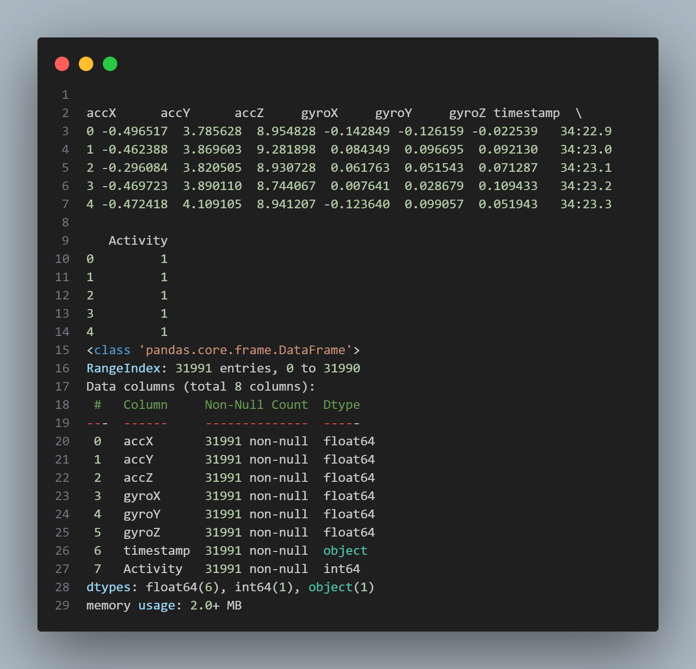
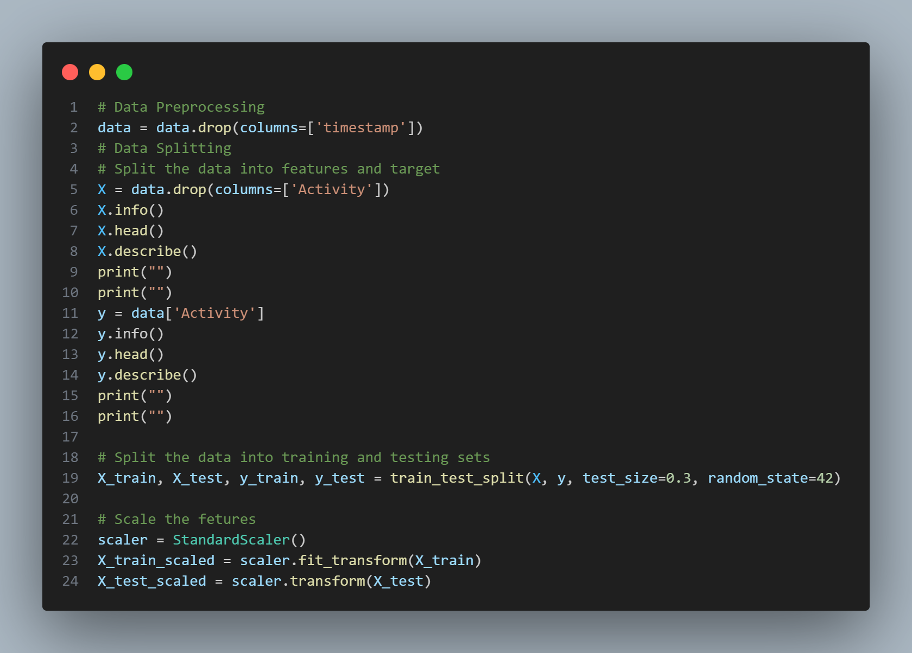
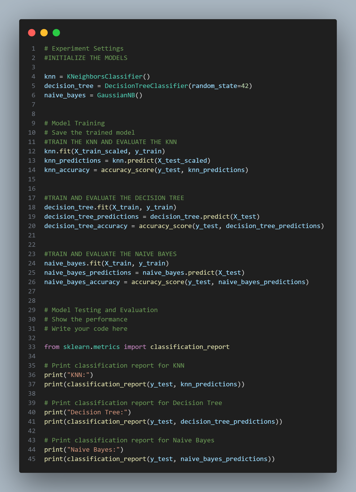
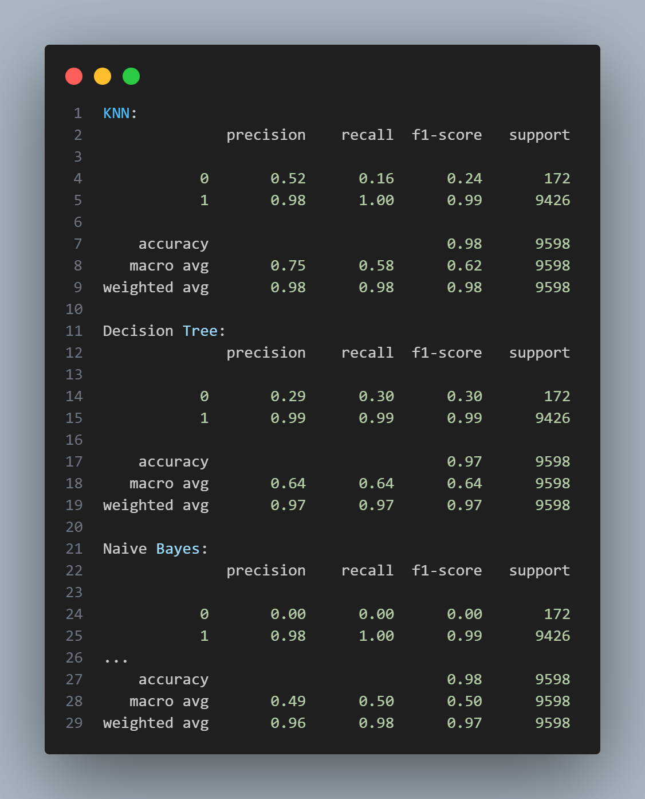
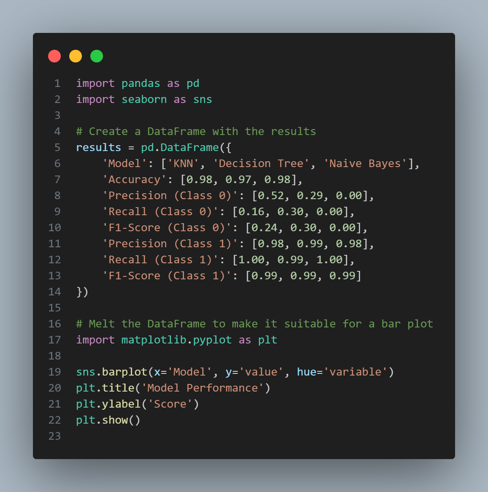
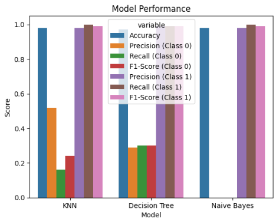
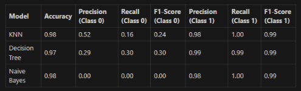

# Binary Classsification on [Accelerometer Gyro Mobile Phone ] using KNN, Decision Tree and Gaussian Naive Baiyes










## Group Members
| NIM        | Name                                | Tugas                                   |
| --------   | ---------------------------         |-----------------------------------------|
| 1301225492 | Romario Viegas Francisco Marcal     | Analisys, comparison and testing the data  |
| 1301224458 | Ari Ramadhan                        | Exploratory data |
| 1301224446 | Edric Veda Adiyatma                      | Explain Source Code                     |

## About this project
- Solves the problem of activity recognition, with the accelerometer Mobile dataset.
- Make a comparison and found out which model is performed better between KNN, Gaussian Naive Baiyes and Decision tree algorithm.
- Programmed in `python v.3.10.9` or up

## Features and target Data

The features data are the 7 features data that exist in the dataset such as : accX, accY, accZ, gyroX, gyroY, gyroZ, and timestamp, but after we drop the because of the efficiency of the training data because the algorithm did not use the timestamp, therefore we should remove the timestamp variable.
 
And the target data is the activity data, that we can divide into 2 class such as 0(walking) and 1(standing).

## Requirements 
- Latest `Python 3` version
- `matplotlib`
- `tkinter`

## Setup
Make sure all requirements are installed in your local machine beforehand. Then, clone this repository.
```bash
git clone https://github.com/Mr-Roma/FINAL-PROJECT-AI.git
```

## Program Structure

```
│ README.md
│ .gitignore
│
└─── assets
      ├─ 1Ai.png
      ├─ 2Ai.png
      ├─ 3Ai.png
      ├─ 4Ai.png
      ├─ 5Ai.png
      ├─ 6Ai.png
      ├─ 7Ai.png
      ├─ 8Ai.png
      ├─ barplot.png
      ├─ results_Accuracy.py
└─── data
└─── AI FINAL PROJECT EXPLANATION.docx
└─── Assesment CLO-GROUP7-ENG.ipynb
└─── testing_assesment_CLO3.ipynb
└─── GROUP7_FINAL_PROJECT_AI.pdf
```